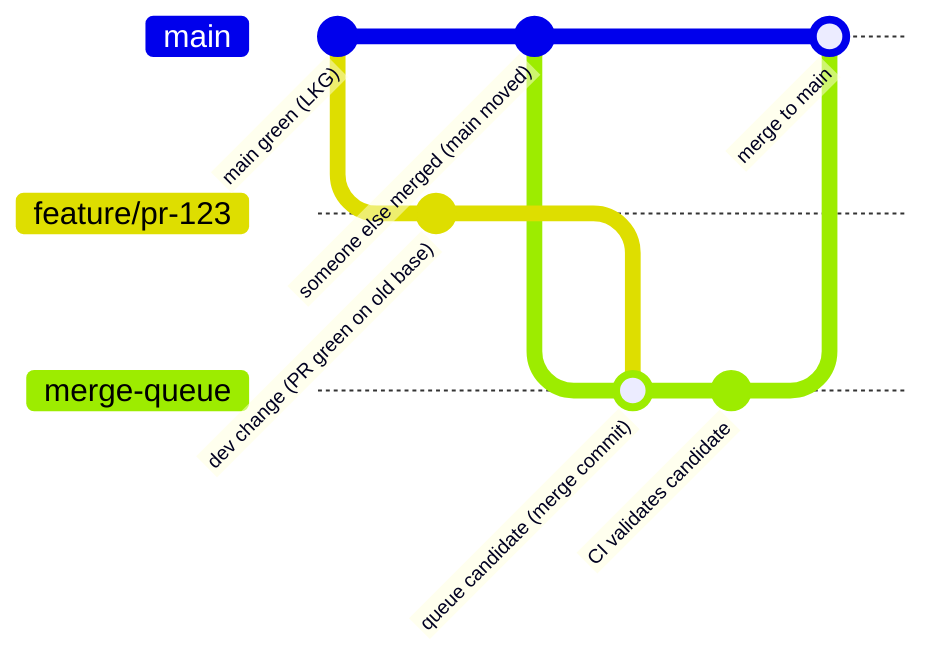

# The post-merge queue pattern

This repository is both documentation and a functional example of a developer productivity pattern.

The goal of a merge queue is to prevent red `main`.

However we need to be more precise, because that branch name is conflating two different things:

- The TARGET of pull requests, against which upcoming changes are tested and will merge
- The BASE branch developers rebase onto or clone in a fresh checkout of the project.

## Pre-merge queues

This is a retronym, because every merge queue out there (Aviator.co, Trunk.io, GitHub) is a pre-merge queue.

The sequence is:

1. `main` (the TARGET branch) is known to be green
1. A developers change satisfies the policy for merge, and is in a green PR
1. We cannot trust the BASE commit of that green PR, because it may be broken by changes that have landed
1. The developer cannot merge to the TARGET branch, instead they submit to a merge queue
1. The developer has to stress out that their change may not merge, and can't go home, context-switch, etc
1. A slow merge queue is a therefore a major productivity drain.
1. The benefit, however, is that the `main` branch which is ALSO the BASE branch, cannot go red, therefore other engineers are unaffected by anything happening in the merge queue.



This system is optimized like pessimistic locking - we act as though in-flight collisions are common (a PR that was green becomes a red `main` after a merge).

However in reality, it's not common. And:

- we've made engineers unproductive
- Developers dislike the experience of the merge queue, having their beautiful new code delayed from merging just because of the slow process of first validating code from their peers
- we need a merge queue vendor and it's yet another complex system to understand, monitor, and operate
- we add more CI load by having yet another pass of running the tests

We can take a better trade-off by shifting this uncommon problem to the right, after merge.

## Post-merge queue

In this case the queue is more sophisticated because we stop conflating the TARGET and BASE as the same branch. While pre-merge queues are pessimistic locking, this is optimistic locking.

For clarity let's refer to these two branches as `edge` and `stable`.

> Note that you could still use the name `main` for either branch - in practice it's easier to have the BASE branch be `main` because developers are so accustomed to typing `git fetch; git rebase origin/main`. The *default* branch is the one pull requests are opened against, so it's tempting to use that as the TARGET branch - but you must also account for fresh checkouts of the repo.

> Also note that these really only need to be "refs" in git terminology, because stable should be purely a fast-forward of the history of `edge`

The sequence now is:

1. `edge` is *likely* green
1. Developers with a green PR and any needed approvals simply merge directly to `edge`.
1. The developer doesn't have to monitor anything and is free to context-switch.
1. In the uncommon case that they need to tell a co-worker "okay I merged, now you're unblocked and can rebase to pick up my change", that co-worker has to be aware of the `edge` branch. But otherwise, it's an implementation detail.
1. The post-merge CI system runs as usual
1. In the common case that `edge` is green, we run the normal CD (continuous delivery) steps of shipping artifacts. We simply add one more of these: the `stable` branch (ref) is fast-forwarded to the new "Last Known Good" state.
1. The delta between the timestamp of the HEAD commit on `edge` and `stable` represents the slowness of changes being vetted, and this is the limiting factor for essential KPIs like "time to delivery" which is important during production outages. Therefore the DevX team monitors this delta.

```mermaid
gitGraph
  commit id:"stable==edge (LKG)"
  branch edge
  checkout edge
  branch feature/pr-456
  checkout feature/pr-456
  commit id:"dev change (PR)"
  checkout edge
  merge feature/pr-456 id:"merge directly to edge"
  commit id:"post-merge CI on edge"
  branch stable
  checkout stable
  merge edge id:"fast-forward stable -> edge (new LKG)"
```

## Build-cop

If `edge` goes red, an on-call is paged (they're often called the "Build Cop").
Yes, this is another rotation, which is a cost of this approach.

> Note that even with a pre-merge queue, tests that have environmental dependencies can still cause `main` to go red, so in practice this role exists anyway.

95% of the time, the culprit is clearly the commit that caused the green->red transition, and the on-call reverts that commit. They immediately push to the `edge` branch without review or consulting others. This is important because other changes are also merging to `edge` and we want to avoid a complex culprit-finding situation where it's unclear how to get back to green - so the SLA for responding is a function of the QPS of commits landing.

